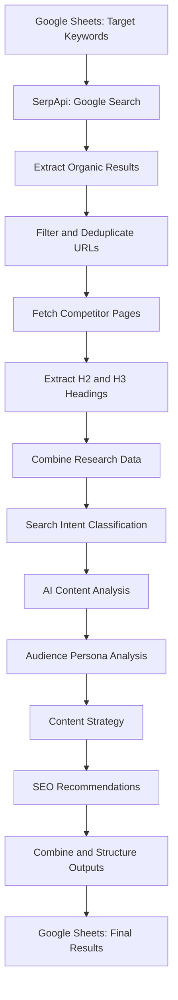

SerpApi AI SEO Content Intelligence Agent

An AI-powered SEO research and content planning automation built with **n8n, SerpApi, Gemini, and Google Sheets**.

The project automates keyword research, search engine results page (SERP) analysis, competitor content research, audience analysis, content gap identification, and SEO content planning through a connected workflow of APIs, data-processing nodes, and AI agents.

---

## Table of Contents

- [1. Project Overview](#1-project-overview)
- [2. Problem Statement](#2-problem-statement)
- [3. Project Objectives](#3-project-objectives)
- [4. Key Features](#4-key-features)
- [5. Technology Stack](#5-technology-stack)
- [6. Workflow Architecture](#6-workflow-architecture)
- [7. How the Workflow Works](#7-how-the-workflow-works)
- [8. Prerequisites](#8-prerequisites)
- [9. Repository Structure](#9-repository-structure)
- [10. Installation and Setup](#10-installation-and-setup)
- [11. Google Sheets Configuration](#11-google-sheets-configuration)
- [12. Importing the n8n Workflow](#12-importing-the-n8n-workflow)
- [13. Configuring Credentials](#13-configuring-credentials)
- [14. Running the Workflow](#14-running-the-workflow)
- [15. Expected Outputs](#15-expected-outputs)
- [16. Customization](#16-customization)
- [17. Troubleshooting](#17-troubleshooting)
- [18. Security and Best Practices](#18-security-and-best-practices)
- [19. SerpApi Integration](#19-serpapi-integration)
- [20. AI Usage Disclosure](#20-ai-usage-disclosure)
- [21. Limitations](#21-limitations)
- [22. Future Enhancements](#22-future-enhancements)
- [23. Demo](#23-demo)
- [24. Author](#24-author)
- [25. License](#25-license)

---

## 1. Project Overview

The **SerpApi AI SEO Content Intelligence Agent** is an automated research and content planning system designed to reduce the manual effort involved in preparing SEO content briefs.

Given a target keyword, the workflow retrieves Google search results through SerpApi, identifies relevant competitor pages, extracts their content headings, and uses AI models to analyze the collected research.

The workflow can combine competitor content, keyword research, and search intent signals to generate structured SEO deliverables, including content outlines, audience insights, content gap analysis, content strategy, and SEO recommendations.

The generated information is organized and stored in Google Sheets for further review and content production.

### Example use case

**Input keyword:** `sso solutions`

The workflow researches relevant search results and competitor pages, identifies recurring topics and potential content opportunities, and generates an SEO content plan aligned with the target search intent.

### Intended users

- SEO professionals
- Content strategists
- Digital marketing teams
- Content writers
- SaaS marketing teams
- Developers building AI-powered research automations

---

## 2. Problem Statement

Preparing an SEO content brief typically requires several manual activities:

- Researching search results for a target keyword.
- Finding relevant competitor pages.
- Reviewing competitor headings and content structure.
- Collecting related and secondary keywords.
- Understanding search intent and audience needs.
- Identifying topics that competing pages may not cover adequately.
- Planning article structure and content recommendations.
- Organizing the research in a reusable document or spreadsheet.

Performing these tasks manually can be time-consuming and difficult to repeat consistently across many keywords.

This project combines search data, workflow automation, and AI-assisted analysis into a single research pipeline.

---

## 3. Project Objectives

The primary objectives are to:

1. Automate SERP research using SerpApi.
2. Discover and filter relevant competitor URLs.
3. Extract competitor headings for content structure analysis.
4. Organize keyword and competitor research into structured data.
5. Use AI agents to analyze content opportunities and audience needs.
6. Generate search-intent-aligned content planning recommendations.
7. Consolidate research outputs into Google Sheets.
8. Create a repeatable workflow that can be reused for multiple target keywords.

---

## 4. Key Features

### 4.1 SERP Research

Uses SerpApi to retrieve Google search results for a target keyword and identify relevant organic search listings.

### 4.2 Competitor URL Discovery

Collects competitor URLs from search results, filters unwanted domains, removes duplicate URLs, and selects a limited set of pages for further analysis.

### 4.3 Competitor Content Extraction

Uses HTTP requests and HTML extraction to collect relevant headings, particularly H2 and H3 elements, from accessible competitor pages.

### 4.4 Keyword Research and Organization

Organizes primary keywords, secondary keywords, and other relevant keyword opportunities. If the configured keyword research integration is enabled, its results can contribute additional keyword insights.

### 4.5 Search Intent Analysis

Uses classification and AI-assisted analysis to help identify the likely intent behind a target keyword and route it to an appropriate content-planning approach.

### 4.6 Content Gap Analysis

Analyzes the collected competitor research to identify potential topic gaps, missing subtopics, and opportunities for stronger content coverage.

### 4.7 Audience Persona Analysis

Uses the keyword, search intent, and available research context to develop audience insights, including likely pain points, goals, decision factors, and desired outcomes.

### 4.8 Content Strategy Generation

Generates content planning recommendations based on the target keyword, search intent, competitor research, and audience analysis.

### 4.9 SEO Recommendations

Produces recommendations for content format, article structure, keyword coverage, content length, and other SEO planning considerations supported by the workflow inputs.

### 4.10 Google Sheets Integration

Stores structured research results in Google Sheets so the information can be reviewed, organized, and reused in the content production process.

---

## 5. Technology Stack

| Technology | Purpose |
|---|---|
| n8n | Workflow orchestration and automation |
| SerpApi | Google search results retrieval |
| Google Sheets | Keyword input and research output storage |
| Gemini | AI-assisted research and content analysis |
| HTTP Request nodes | Retrieving competitor web pages |
| HTML extraction | Extracting headings and page content |
| JavaScript Code nodes | Filtering URLs, removing duplicates, and transforming data |
| Output parsers | Structuring AI-generated responses |
| Apify / SEMrush integration, if enabled | Additional keyword research data |

**Note:** The integrations and models required depend on the exact workflow export. Configure only the services used by the nodes included in your version of the workflow.

---

## 6. Workflow Architecture

The workflow follows a research-to-recommendation pipeline.



The diagram is a conceptual representation of the research pipeline. The actual execution order and branching should follow the exported n8n workflow.

### Main workflow stages

1. **Input:** Read target keywords and associated research parameters.
2. **Search:** Retrieve current Google search results through SerpApi.
3. **Filtering:** Remove blocked domains and duplicate URLs.
4. **Extraction:** Fetch accessible competitor pages and extract useful headings.
5. **Analysis:** Combine research data and analyze search intent, content gaps, and audience needs.
6. **Recommendation:** Generate content strategy and SEO recommendations.
7. **Storage:** Map the generated fields and save the results in Google Sheets.

---

## 7. How the Workflow Works

### Step 1: Provide a target keyword

The workflow starts with a keyword supplied through the configured Google Sheets input or another configured trigger.

Example:

```text
sso solutions
```

Secondary keywords and additional research parameters may also be supplied when available.

### Step 2: Retrieve search results using SerpApi

The workflow sends a Google Search request through SerpApi.

The returned search results are used to discover relevant organic listings and competitor URLs.

### Step 3: Filter competitor URLs

A Code node processes the collected URLs.

The filtering stage can:

- Ignore missing or invalid URLs.
- Exclude domains specified in the blocked-domain list.
- Remove duplicate URLs.
- Limit the number of competitor pages selected for extraction.

This helps focus the research on a manageable set of relevant pages.

### Step 4: Fetch competitor pages

The HTTP Request nodes attempt to retrieve the selected competitor pages.

Some sites may reject automated requests, restrict access, or take too long to respond. The workflow should handle these failures without unnecessarily stopping the remaining research.

### Step 5: Extract competitor headings

HTML extraction nodes collect available headings, particularly H2 and H3 elements.

These headings provide a structured view of how competing pages organize their content.

The extracted information can be combined for downstream analysis.

### Step 6: Prepare the research dataset

The workflow combines the available search results, extracted headings, keyword information, and other configured research data.

Code nodes can normalize field names, remove duplicates, filter irrelevant values, and prepare the data for AI analysis.

### Step 7: Analyze search intent

The configured classifier or AI model evaluates the keyword and supporting research to determine the appropriate search-intent category.

Possible intent categories depend on the workflow's configured classification prompts.

The resulting intent can guide the content structure and recommendations.

### Step 8: Generate content insights with AI

The workflow uses AI agents or model nodes to analyze the available research.

Depending on the configured agents, this can include:

- Content gap analysis.
- Audience persona analysis.
- Content strategy generation.
- SEO recommendations.
- Content outline generation.

Structured output parsers can be used to enforce the expected response format.

### Step 9: Combine the results

A Code node maps the individual research outputs into the final data structure.

This stage is important because each output field must match the destination Google Sheets column.

### Step 10: Store the results

The Google Sheets node writes the final structured research into the configured spreadsheet.

The resulting data can then be reviewed and used as a starting point for SEO content planning.

---

## 8. Prerequisites

Before setting up the workflow, ensure that you have the following.

### Required services

- **n8n:** A working n8n instance, either self-hosted or hosted.
- **SerpApi:** An account and API key for Google search requests.
- **Google Sheets:** A Google account with access to create or edit a spreadsheet.
- **AI provider:** Valid credentials for the AI model configured in the workflow.

### Additional requirements, when applicable

- Apify access and a valid token if an Apify actor is used.
- Access to the relevant keyword research service if the workflow uses an external keyword research integration.
- Any additional credentials or community nodes required by the exported workflow.

### Basic knowledge

Familiarity with n8n nodes, Google Sheets, API credentials, and basic JSON concepts will make setup easier.

---

## 9. Repository Structure

The repository is intended to use the following structure:

```text
serpapi-ai-seo-content-intelligence-agent/
│
├── README.md
│
├── workflows/
│   └── seo-content-intelligence.json
│
├── docs/
│   ├── architecture.md
│   └── workflow-screenshot.png
│
├── .env.example
│
└── LICENSE
```

### File descriptions

- `README.md` — Project overview and setup instructions.
- `workflows/seo-content-intelligence.json` — Sanitized, exported n8n workflow.
- `docs/architecture.md` — Detailed node descriptions and architecture.
- `docs/workflow-screenshot.png` — Screenshot of the workflow architecture.
- `.env.example` — Placeholder configuration names, if needed.
- `LICENSE` — Project license, if one is selected.

Only include files that actually exist in the repository. Do not upload real credentials, private execution data, or sensitive exports.

---

## 10. Installation and Setup

Follow these steps to configure the project.

### Step 1: Obtain the repository

Clone the repository:

```bash
git clone https://github.com/bali1527/serpapi-ai-seo-content-intelligence-agent.git
```

Navigate into the project directory:

```bash
cd serpapi-ai-seo-content-intelligence-agent
```

Alternatively, use GitHub's **Code → Download ZIP** option to download the repository.

### Step 2: Open n8n

Open your existing n8n instance.

If you do not have an instance, follow the official n8n installation documentation:

https://docs.n8n.io/hosting/

The project itself is an n8n workflow, so a separate Python application or Node.js backend is not required unless additional components are introduced.

### Step 3: Download the workflow file

Locate the workflow JSON file in:

```text
workflows/seo-content-intelligence.json
```

If the file has a different name in the repository, use its actual name.

### Step 4: Import the workflow

In n8n:

1. Open the workflow editor.
2. Open the workflow menu.
3. Select **Import from File**.
4. Choose the downloaded workflow JSON.
5. Review the imported nodes and connections.
6. Check whether any required nodes or credentials need to be configured.

Importing the workflow does not automatically configure every external service. Credentials and other dependencies must be configured in the target n8n instance.

### Step 5: Configure credentials

Set up the credentials required by the imported nodes.

See [Configuring Credentials](#13-configuring-credentials).

### Step 6: Configure Google Sheets

Create or select your own spreadsheet and ensure the input and output sheets match the columns expected by the workflow.

See [Google Sheets Configuration](#11-google-sheets-configuration).

### Step 7: Review the workflow

Before execution, verify:

- All required credentials are assigned.
- Google Sheets document and sheet references are correct.
- The input keyword is available.
- The SerpApi node is configured for the intended search.
- Competitor filtering and extraction nodes are connected correctly.
- AI model nodes and output parsers are configured.
- Final field mappings match the output sheet headers.

### Step 8: Run a test

Execute the workflow with a test keyword such as `sso solutions`.

Inspect the execution data at each stage and verify that the final results are stored correctly.

---

## 11. Google Sheets Configuration

The workflow uses Google Sheets for keyword input and structured output storage.

The exact sheet names and column requirements should match the spreadsheet references in your imported workflow.

### 11.1 Input sheet

Create a sheet containing the target keywords and any required research parameters.

For example:

| primary_keyword | secondary_keywords |
|---|---|
| sso solutions | sso single sign on; enterprise sso |

The actual required input fields depend on the configuration of your workflow's Google Sheets and data-processing nodes.

### 11.2 Output sheet

Create an output sheet with the column headers expected by the final Google Sheets node.

For an outline-focused output, the columns may include:

| Column | Description |
|---|---|
| `generated_date` | Date the result was generated |
| `primary_keyword` | Target keyword |
| `secondary_keywords` | Related keywords |
| `other_relevant_keywords` | Additional keyword opportunities |
| `content_title` | Suggested content title |
| `h1` | Generated H1 heading |
| `generated_h2s` | Generated H2 headings |
| `generated_h3s` | Generated H3 headings |

If your workflow also stores audience research, content gap analysis, strategy, or SEO recommendations, include the corresponding columns required by those output mappings.

**Important:** Column headers and field mappings must match. Incorrect names or incompatible data types can lead to missing or undefined values.

### 11.3 Connect Google Sheets

1. Open the Google Sheets nodes in n8n.
2. Select or create the appropriate Google Sheets credential.
3. Authorize access through your Google account.
4. Select your own spreadsheet and the relevant worksheet.
5. Confirm the expected operation, such as reading input rows or appending results.
6. Test the node independently before executing the entire workflow.

Never use another person's private spreadsheet or OAuth credentials when setting up your own instance.

---

## 12. Importing the n8n Workflow

The workflow is distributed as JSON because n8n supports exporting and importing workflows in JSON format.

Official documentation:

https://docs.n8n.io/workflows/export-import/

### Import checklist

After importing:

- Confirm that the workflow opens without errors.
- Verify that node connections are intact.
- Reassign credentials where required.
- Check any hardcoded spreadsheet references.
- Confirm that the AI nodes reference the intended models.
- Check output parser schemas and Code node logic.
- Test the workflow before activating any scheduled or automated trigger.

Workflow exports can still contain sensitive values in node parameters, even when credential secrets themselves are not included. Inspect the JSON before sharing it publicly.

---

## 13. Configuring Credentials

The workflow may require credentials for SerpApi, Gemini, Google Sheets, and any optional keyword research integrations.

### 13.1 SerpApi

1. Create or access your SerpApi account.
2. Obtain your API key.
3. Open the SerpApi node in n8n.
4. Configure the authentication method expected by that node.
5. Save the credential securely and test the node.

SerpApi documentation:

https://serpapi.com/search-api

### 13.2 Gemini

1. Obtain access to the Gemini API.
2. Create the required API credential.
3. Configure the corresponding Gemini or AI model node in n8n.
4. Select the required model.
5. Check the prompt and output settings.
6. Execute the node with sample input.

Gemini API documentation:

https://ai.google.dev/gemini-api/docs

### 13.3 Google Sheets

1. Open the relevant Google Sheets node.
2. Create or select the supported Google Sheets OAuth credential.
3. Complete the required Google authorization process.
4. Select the target spreadsheet.
5. Verify that the credential can read or write to the selected sheet.

If your n8n configuration requires a Google OAuth Client ID and Client Secret, configure them using the appropriate secure credential or OAuth setup. Do not publish the secret in the repository.

### 13.4 Optional integrations

If the workflow contains an Apify actor or another keyword research service, configure its credentials according to that provider's documentation.

Only configure integrations that are actually used by your imported workflow.

---

## 14. Running the Workflow

After completing setup, follow this execution procedure.

### Step 1: Prepare the keyword

Add a test keyword to the configured input sheet or input node.

Example:

```text
sso solutions
```

### Step 2: Execute the workflow

Open the workflow in n8n and select **Execute Workflow** or execute the appropriate starting node, depending on the trigger configuration.

### Step 3: Inspect the SerpApi output

Verify that the search request succeeds and returns relevant organic search results.

### Step 4: Inspect competitor URLs

Check that the URL filtering stage:

- Removes blocked domains.
- Removes duplicate URLs.
- Keeps valid competitor URLs.
- Returns the expected number of URLs.

### Step 5: Inspect extracted headings

Confirm that accessible competitor pages return usable page content and heading data.

If a website fails, inspect the error and ensure that one failed page does not unnecessarily stop all remaining requests.

### Step 6: Inspect AI outputs

Review the output of the configured AI agents.

Ensure that responses contain meaningful research rather than empty values, `false` placeholders, malformed JSON, or undefined fields.

### Step 7: Verify the final mapping

Check that the final Code node produces the correct field names and data types expected by Google Sheets.

### Step 8: Verify the spreadsheet

Open the output spreadsheet and confirm that the result has been written to the intended worksheet.

---

## 15. Expected Outputs

The workflow is designed to transform keyword research into structured SEO planning information.

Depending on the enabled nodes and output configuration, the resulting information may include:

- Target keyword and related keywords.
- Relevant competitor URLs.
- Extracted competitor headings.
- Suggested content title and outline.
- Search intent classification.
- Potential content gaps.
- Audience persona insights.
- Content strategy recommendations.
- SEO planning recommendations.

### Example output concept

For the keyword `sso solutions`, the workflow may identify relevant competitor pages, collect their accessible headings, and generate a proposed outline covering topics such as SSO fundamentals, implementation considerations, integrations, security, and solution evaluation.

This is an illustrative example. Actual results depend on current search results, accessible competitor pages, model responses, and the prompts configured in the workflow.

### Output validation

A successful workflow execution should be verified at three levels:

1. **Data collection:** Search results and competitor research are available.
2. **AI analysis:** Generated outputs are meaningful and conform to the expected structure.
3. **Data storage:** Correct values are written to the intended Google Sheets columns.

---

## 16. Customization

The workflow can be adapted to different keywords and content research requirements.

### Change the target keyword

Update the keyword in the input sheet or the configured input node.

### Adjust the number of competitors

Change the limit applied after URL filtering to control how many competitor pages are processed.

A smaller limit reduces the number of page requests but may provide less coverage.

### Customize blocked domains

Modify the Code node's blocked-domain list to exclude sites that are irrelevant, inaccessible, or unsuitable for the research objective.

Review exclusions carefully so useful competitor pages are not removed unintentionally.

### Modify AI prompts

Update the prompts for content gap analysis, audience personas, content strategy, SEO recommendations, or outline generation.

After making changes, test the output format and verify that the agents still produce valid results.

### Update Google Sheets columns

If you add, remove, or rename output columns, update the final field mappings and any intermediate transformations that depend on those fields.

### Adjust request handling

Tune HTTP request timeouts, retry settings, and error-handling behavior according to the websites being researched and the needs of your workflow.

---

## 17. Troubleshooting

### Issue 1: SerpApi request fails

**Possible causes:**

- Invalid API key.
- Incorrect request parameters.
- API quota or account restrictions.
- Temporary service or network issues.

**Resolution:**

Verify the credential, inspect the node's error message, and test the search request independently.

### Issue 2: Competitor URL is missing

**Possible causes:**

- The URL is included in the blocked-domain list.
- The URL was removed as a duplicate.
- The input data uses an unexpected field name.
- An earlier node filtered the result.

**Resolution:**

Inspect the output of the URL collection and filtering nodes. Confirm that the expected URL is present before filtering.

### Issue 3: HTTP Request times out

**Possible causes:**

- The website responds slowly.
- Automated requests are restricted.
- The page is large.
- The network connection is unreliable.

**Resolution:**

Increase the timeout where appropriate, enable retries, and use error handling to skip failed pages. A longer timeout will not resolve a permanent block.

### Issue 4: HTML extraction returns empty headings

**Possible causes:**

- The page uses dynamically rendered content.
- The HTML structure differs from the extraction configuration.
- The page returned an error or challenge instead of the expected content.
- The selectors do not match the page.

**Resolution:**

Inspect the HTTP response and adjust the HTML extraction configuration. Use only accessible content and do not assume every website can be extracted successfully.

### Issue 5: AI agent returns `false` or empty values

**Possible causes:**

- The prompt does not clearly specify the required output.
- The structured output parser is missing or misconfigured.
- The model returns data in a different format.
- Required input fields are missing.

**Resolution:**

Review the prompt, connect and configure the output parser where required, verify the expected field types, and execute the agent again.

### Issue 6: Google Sheets contains undefined or missing values

**Possible causes:**

- Incorrect field names.
- An earlier node changed the JSON structure.
- The output mapper references fields that do not exist.
- Arrays or objects are being sent in a format unsuitable for the target cell.

**Resolution:**

Inspect the preceding node's JSON output and ensure the final field mappings match the actual keys. Convert complex values to an appropriate text representation when necessary.

### Issue 7: Google Sheets authentication fails

**Possible causes:**

- Expired or invalid authorization.
- Missing spreadsheet permissions.
- Incorrect spreadsheet or worksheet selection.

**Resolution:**

Reauthorize the credential, confirm spreadsheet access, and test the Google Sheets node independently.

---

## 18. Security and Best Practices

Security is essential when publishing an automation workflow in a public repository.

### Never commit secrets

Do not publish:

- SerpApi API keys.
- Gemini API keys.
- Google OAuth Client Secrets.
- Access tokens or refresh tokens.
- Passwords or authorization headers.
- Private webhook URLs or sensitive personal data.

Use n8n's credential-management features wherever possible.

### Inspect the exported workflow

Before publishing the workflow JSON:

1. Export the workflow.
2. Open the JSON file in a text editor.
3. Search for sensitive values, including `api_key`, `clientSecret`, `access_token`, `refresh_token`, and `Authorization`.
4. Inspect suspicious node parameters and hardcoded headers.
5. Replace any exposed secrets with safe placeholders or remove them.
6. Verify that the cleaned JSON remains valid and can be imported.

Credential secrets are generally not included in normal workflow exports, but sensitive values may still exist in node parameters. Always inspect the actual file.

### Protect spreadsheet data

Use your own test spreadsheet when demonstrating the project. Do not publish private customer information, confidential business data, or personal account details.

### Use `.gitignore` where appropriate

Exclude local configuration files, temporary exports, logs, private datasets, and files containing credentials.

Do not rely on `.gitignore` as a substitute for checking the files you upload manually through GitHub.

### If a secret is exposed

Revoke or rotate the exposed credential immediately. Removing it from the latest file does not invalidate a secret that was already published in repository history.

---

## 19. SerpApi Integration

SerpApi is a core data source for this project.

The workflow uses the Google Search API to retrieve search results for a target keyword. The organic listings provide competitor URLs that feed into the downstream research pipeline.

The collected search intelligence supports:

- Competitor discovery.
- Competitor page selection.
- Content structure research.
- Context for AI-assisted content analysis.
- SEO content planning.

The usefulness of the downstream analysis depends partly on the quality and relevance of the search results and competitor pages collected.

Official documentation: https://serpapi.com/search-api

---

## 20. AI Usage Disclosure

This project uses AI for research analysis and content recommendation generation.

The exact models, tools, and their contributions should be disclosed accurately.

For example, if these tools were used in your implementation:

- **Gemini:** AI-assisted content research, audience analysis, strategy generation, and SEO recommendations.
- **n8n:** Workflow orchestration, API integration, data transformation, and automation.
- **ChatGPT:** Development assistance, prompt refinement, and troubleshooting, if applicable.
- **SerpApi:** Retrieval of Google search results used for competitor discovery and research.

Update this section to reflect the tools actually used and their real contributions.

AI-generated research should be reviewed before being used in published content or business decisions.

---

## 21. Limitations

- Search results can change over time.
- Some competitor websites may block automated requests or return incomplete content.
- HTTP requests may time out or fail because of website restrictions.
- Extracted headings may not represent the full page content.
- AI-generated insights may contain inaccuracies or unsupported assumptions.
- Search intent and audience persona predictions are estimates, not verified user research.
- Keyword metrics depend on the configured data sources and may not be available in every run.
- Workflow execution depends on API availability, credentials, rate limits, and external service configuration.
- Users must configure their own credentials and spreadsheet access.

---

## 22. Future Enhancements

Potential improvements include:

- More robust retry and error-handling mechanisms.
- Better competitor relevance scoring.
- More advanced keyword clustering.
- Improved content gap prioritization.
- Validation of AI output schemas.
- Support for additional search engines or research providers.
- Content brief export to Markdown or other document formats.
- Execution monitoring and structured logs.
- Cost and token usage tracking.
- Automated quality checks for generated outlines.

These are potential future enhancements and should not be considered implemented features unless they are added and tested.

---

## 23. Demo

**Demo video:** Add the public or unlisted demo video URL here after uploading it.

The demonstration should show:

1. The overall n8n workflow.
2. A target keyword being processed.
3. SerpApi returning relevant search results.
4. Competitor URL filtering and heading extraction.
5. AI-generated research and content recommendations.
6. The final results appearing in Google Sheets.

Use a test keyword and non-sensitive data during recording.

---

## 24. Author

**Balaji Rithesh G**

GitHub: https://github.com/bali1527

Project repository: https://github.com/bali1527/serpapi-ai-seo-content-intelligence-agent

---

## 25. License

No license has been selected for this project yet.

If you intend to allow others to reuse, modify, and distribute the project, choose an appropriate open-source license and add the corresponding `LICENSE` file.

Until a license is added, do not imply that the repository has an open-source license.
