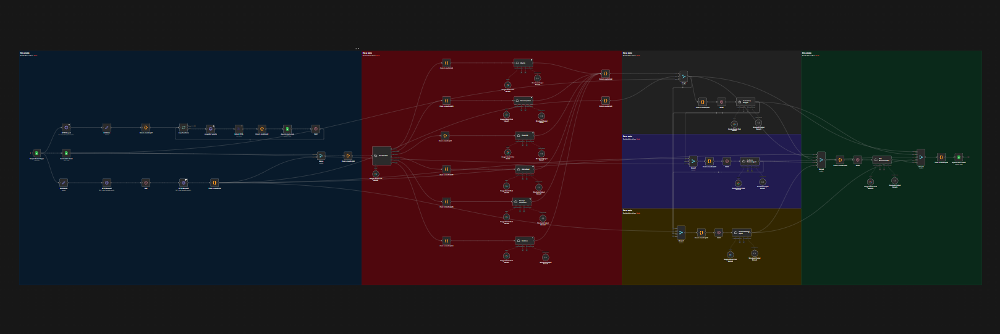
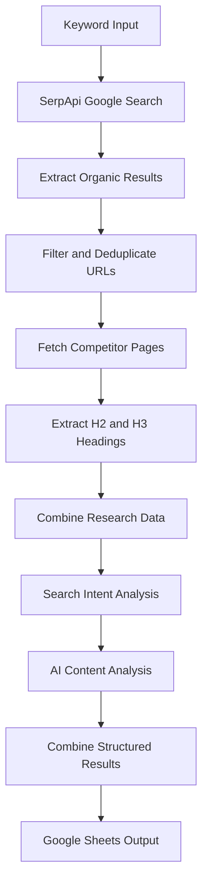
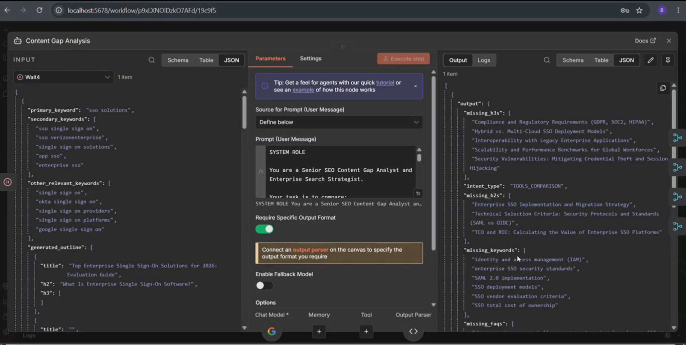
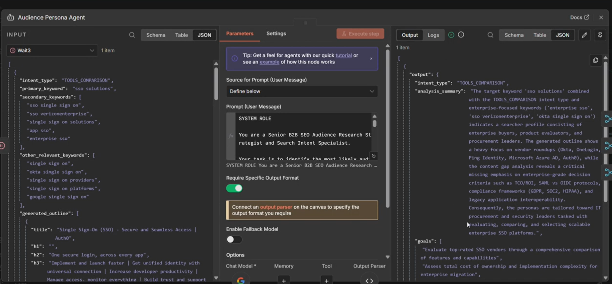
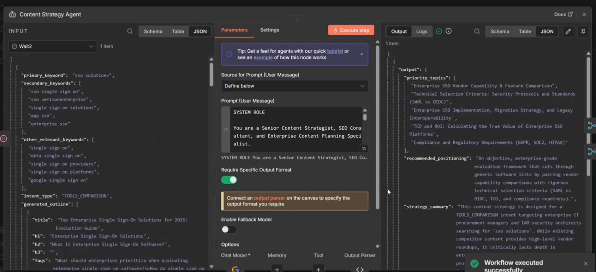
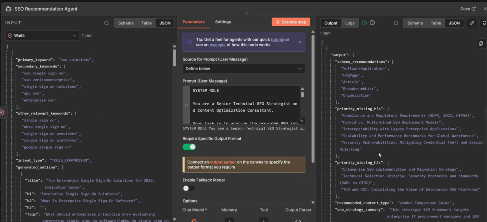
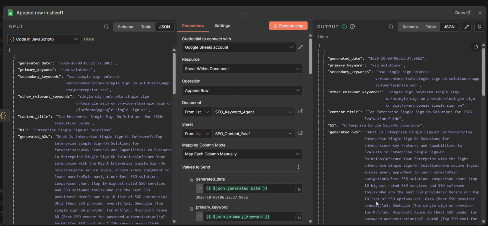

# SerpApi AI SEO Content Intelligence Agent

**Automated SEO research, competitor analysis, and AI-powered content planning using SerpApi, n8n, Gemini, and Google Sheets.**

[](https://n8n.io/)
[](https://serpapi.com/)
[](https://ai.google.dev/)
[](https://sheets.google.com/)

## 1. Project Overview

The **SerpApi AI SEO Content Intelligence Agent** is an automated SEO research and content planning workflow built using n8n, SerpApi, AI models, and Google Sheets.

The workflow takes a target keyword, retrieves Google search results through SerpApi, identifies relevant competitor pages, extracts available competitor headings, and uses AI agents to analyze the collected research.

The collected information is used to support content gap analysis, audience persona research, content strategy development, SEO recommendations, and content outline generation. The results are consolidated into structured data and stored in Google Sheets for further review.

The primary goal is to reduce repetitive manual SEO research and help content strategists develop more informed, search-intent-aligned content plans.

## 2. Problem Statement

Preparing a high-quality SEO content brief requires multiple research activities, including:

- Researching Google search results for target keywords.
- Identifying relevant competitor pages.
- Reviewing competitor content structures and headings.
- Collecting related and secondary keyword opportunities.
- Understanding search intent and audience requirements.
- Identifying potential content gaps.
- Developing an appropriate content strategy.
- Organizing the findings into a structured content plan.

Performing these tasks manually can be time-consuming, particularly when the process needs to be repeated for multiple keywords.

This project combines search intelligence, automated data collection, and AI-assisted analysis into a unified workflow to simplify the SEO research process.

## 3. Project Objectives

The project aims to:

1. Automate Google SERP research using SerpApi.
2. Discover, filter, and deduplicate competitor URLs.
3. Extract available H2 and H3 headings from competitor pages.
4. Organize keyword and competitor research into structured data.
5. Analyze search intent and potential content opportunities.
6. Generate audience insights and content planning recommendations.
7. Produce structured SEO research outputs using AI agents.
8. Store the generated results in Google Sheets.
9. Provide a reusable workflow for keyword-driven SEO content planning.

## 4. Key Features

### 4.1 SERP Research with SerpApi

Retrieves Google search results for a target keyword and identifies relevant organic search listings. These results provide the starting point for competitor discovery and subsequent analysis.

### 4.2 Competitor URL Discovery and Filtering

Processes the URLs returned by the search stage, removes duplicates, filters unwanted domains, and limits the number of competitor pages selected for analysis.

### 4.3 Competitor Heading Extraction

Fetches accessible competitor pages and extracts relevant headings, particularly H2 and H3 elements, to understand how competing pages organize their content.

### 4.4 Keyword Research and Organization

Organizes primary keywords, secondary keywords, and other relevant keyword opportunities for downstream SEO analysis.

Additional keyword metrics depend on the research integrations configured in the workflow.

### 4.5 Search Intent Analysis

Uses the configured classification logic and AI prompts to identify the likely search intent and guide the content planning process.

### 4.6 Content Gap Analysis Agent

Analyzes available competitor research to identify potential missing topics, undercovered subtopics, and opportunities to improve content coverage.

### 4.7 Audience Persona Agent

Uses the target keyword, search intent, and available research context to generate audience insights, such as likely pain points, goals, decision factors, and desired outcomes.

### 4.8 Content Strategy Agent

Uses the research findings to develop content planning recommendations aligned with the target keyword and audience needs.

### 4.9 SEO Recommendation Agent

Generates SEO planning recommendations based on the available keyword information, competitor research, search intent, and AI analysis.

### 4.10 Content Outline Generation

Produces a proposed content structure, including a suggested title, H1, H2 headings, and H3 subheadings, according to the configured prompts and output format.

### 4.11 Automated Google Sheets Storage

Combines the generated research into structured fields and writes the results to Google Sheets for review and further content planning.

## 5. Technology Stack

| Technology | Purpose |
|---|---|
| n8n | Workflow orchestration and automation |
| SerpApi | Google search results and competitor discovery |
| Gemini | AI-assisted research and content analysis |
| Google Sheets | Keyword input and structured output storage |
| HTTP Request nodes | Fetching competitor web pages |
| HTML extraction | Extracting competitor headings |
| JavaScript Code nodes | URL filtering, deduplication, and data transformation |
| AI Agent nodes | Content gap, audience, strategy, and SEO analysis |
| Structured Output Parser | Validating the expected structure of AI responses |

Additional integrations, such as Apify or external keyword research services, may be used where configured in the workflow.

## 6. Workflow Architecture

The workflow follows a keyword-to-content-intelligence pipeline.

### Architecture Overview



The color-coded sections in the n8n canvas organize the workflow into logical processing stages, making the connections between research, analysis, and output easier to understand.

### High-Level Data Flow



The actual n8n workflow may contain additional branches, supporting nodes, and parallel processing stages. The diagram above summarizes the main research pipeline.

## 7. How the Workflow Works

### Step 1: Keyword Input

The workflow receives a target keyword through the configured Google Sheets input or another configured input node.

Example:

` sso solutions `

Secondary keywords and other research parameters may also be provided when available.

### Step 2: Search with SerpApi

The workflow sends a Google Search request through SerpApi and retrieves the relevant search results.

The returned organic listings provide competitor URLs for the research pipeline.

### Step 3: Competitor URL Processing

A JavaScript Code node processes the collected URLs.

The processing stage can:

- Skip missing or invalid URLs.
- Filter configured blocked domains.
- Remove duplicate URLs.
- Limit the number of competitor pages to process.

This helps focus subsequent requests on a manageable set of research targets.

### Step 4: Competitor Page Retrieval

HTTP Request nodes attempt to retrieve the selected competitor pages.

The workflow must account for websites that respond slowly, restrict automated access, or return errors. Failed page requests should be handled without unnecessarily interrupting the entire research process.

### Step 5: Heading Extraction

HTML extraction nodes collect available H2 and H3 headings from accessible pages.

These headings provide a structured representation of competitor content organization and serve as research input for the analysis stages.

### Step 6: Research Data Preparation

The workflow combines the collected search results, competitor headings, keyword information, and other configured research data.

JavaScript Code nodes can normalize fields, filter irrelevant values, remove duplicates, and prepare the data for AI analysis.

### Step 7: Search Intent Analysis

The configured classifier or AI model analyzes the target keyword and available research context to determine the likely search intent.

The resulting classification helps guide the content planning and recommendation process.

### Step 8: AI Agent Analysis

The workflow uses its configured AI agents to analyze the collected research.

Depending on the implemented configuration, these agents generate:

- Content gap insights.
- Audience persona insights.
- Content strategy recommendations.
- SEO recommendations.
- Content outline suggestions.

The quality of these outputs depends on the available research data, prompts, model capabilities, and output validation.

### Step 9: Output Consolidation

The generated agent outputs are combined and mapped into the final data structure.

This stage ensures that the output fields correspond to the expected Google Sheets columns.

### Step 10: Google Sheets Storage

The final structured results are written to the configured Google Sheets worksheet.

The spreadsheet provides a centralized location for reviewing and reusing the generated SEO research.

## 8. AI Model Selection and Output Quality

The workflow's output quality depends partly on the AI model selected for each agent.

Different models can vary in reasoning capability, contextual understanding, instruction following, structured output reliability, and the depth of their recommendations.

A model that performs well for one task may produce weaker or less detailed results for another. Therefore, the generated content gap analysis, audience insights, content strategy, SEO recommendations, and content outlines may differ when the model is changed.

### Model Used in This Workflow

**Configured model: Gemini 3.8 Flash**  
*Confirm the exact model name or model ID in your n8n configuration before publishing this documentation.*

During testing, the configured Gemini Flash model produced strong results for the workflow's content research and planning tasks.

Model selection should consider:

- Quality and relevance of generated insights.
- Ability to follow detailed prompts.
- Reliability of structured JSON outputs.
- Response time.
- API availability and usage limits.
- Cost and token consumption.

### Why Results May Differ

Generated results can change depending on:

1. The selected AI model.
2. The quality and completeness of the research inputs.
3. The system and user prompts.
4. The output parser and expected schema.
5. The competitor pages successfully retrieved.
6. The search results available at execution time.

Consequently, changing the model may change the quality, structure, completeness, and usefulness of the final output.

The model's performance should be evaluated using the same test keywords and inputs wherever possible. AI-generated recommendations should also be reviewed before being used in published content.

## 9. Prerequisites

Before setting up the workflow, ensure that you have the following.

### Required

- A working n8n instance.
- A SerpApi account and API key.
- Access to the AI model configured in the workflow.
- A Google account with Google Sheets access.
- The exported n8n workflow JSON file.

### Optional, depending on your configuration

- Apify credentials.
- Access to an external keyword research service.
- Additional API credentials required by specific workflow nodes.

### Documentation

- n8n: https://docs.n8n.io/
- SerpApi: https://serpapi.com/search-api
- Gemini API: https://ai.google.dev/gemini-api/docs
- Google Sheets: https://support.google.com/docs/

## 10. Repository Structure

```text
serpapi-ai-seo-content-intelligence-agent/
│
├── README.md
├── Hackathon Workflow.json
│
└── docs/
    ├── Workflow_architecture.png
    ├── content-gap-analysis.png
    ├── audience-persona.png
    ├── content-strategy.png
    ├── seo-recommendations.png
    └── google-sheets-output.png
```

The `docs` folder contains project screenshots when they have been uploaded. Only add filenames to this structure once the corresponding files exist in the repository.

The workflow JSON is a sanitized export intended for importing into another n8n instance.

## 11. Installation and Setup

### Step 1: Clone the Repository

Run the following command in a terminal:

```bash
git clone https://github.com/bali1527/serpapi-ai-seo-content-intelligence-agent.git
```

Navigate to the project directory:

```bash
cd serpapi-ai-seo-content-intelligence-agent
```

Alternatively, download the repository using GitHub's **Code → Download ZIP** option.

### Step 2: Open n8n

Open your existing n8n instance.

If you need to install or configure n8n, follow its official hosting documentation:

https://docs.n8n.io/hosting/

### Step 3: Import the Workflow

1. Open the n8n workflow editor.
2. Open the workflow menu.
3. Select the import option, such as **Import from File**.
4. Select `Hackathon Workflow.json`.
5. Wait for the workflow to load.
6. Review the nodes, connections, and any warnings.

Importing the workflow does not automatically configure all external credentials or spreadsheet references.

### Step 4: Configure Credentials

Set up the credentials required by the SerpApi, AI model, Google Sheets, and any optional integration nodes.

Refer to [Configuring Credentials](#13-configuring-credentials).

### Step 5: Configure Google Sheets

Select your own spreadsheet and ensure its worksheet names, columns, and data structure match the workflow configuration.

Refer to [Google Sheets Configuration](#12-google-sheets-configuration).

### Step 6: Review the Workflow

Before execution, verify that:

- All required credentials are configured.
- The SerpApi node has valid search parameters.
- Competitor URL filtering works correctly.
- HTTP Request nodes are configured appropriately.
- HTML extraction selectors match the expected content.
- AI agents have the correct prompts and model settings.
- Structured output parsers are connected where required.
- The final Code node maps the correct fields.
- The Google Sheets node points to the intended spreadsheet.

### Step 7: Run a Test

Execute the workflow using a test keyword such as `sso solutions`.

Inspect the intermediate node outputs and verify that the final research results are written to Google Sheets.

## 12. Google Sheets Configuration

Google Sheets is used to provide keyword inputs and store structured research outputs.

### 12.1 Input Sheet

Configure the input sheet according to the columns expected by the starting nodes.

Example:

| primary_keyword | secondary_keywords |
|---|---|
| sso solutions | sso single sign on; enterprise sso |

This is an illustrative structure. Use the actual column names required by your workflow.

### 12.2 Output Sheet

The current outline-focused output sheet may contain the following columns:

| Column | Description |
|---|---|
| `generated_date` | Date of generation |
| `primary_keyword` | Target keyword |
| `secondary_keywords` | Related keywords |
| `other_relevant_keywords` | Additional keyword opportunities |
| `content_title` | Generated content title |
| `h1` | Main heading |
| `generated_h2s` | Generated H2 headings |
| `generated_h3s` | Generated H3 headings |

If your final workflow also stores content gap analysis, audience personas, content strategy, or SEO recommendations, configure the corresponding columns and mappings as required.

### 12.3 Connect Google Sheets

1. Open the relevant Google Sheets node.
2. Select or create the required Google Sheets credential.
3. Authorize access through your Google account.
4. Select your spreadsheet and worksheet.
5. Verify the read or write operation.
6. Test the node independently.

Ensure that the final JSON keys and Google Sheets column headers match the expected mappings.

## 13. Configuring Credentials

Credentials must be configured in your own n8n instance.

### 13.1 SerpApi

1. Sign in to your SerpApi account.
2. Obtain your API key.
3. Open the SerpApi node.
4. Configure the authentication method required by the node.
5. Test the search request.

Documentation: https://serpapi.com/search-api

### 13.2 Gemini

1. Obtain access to the Gemini API.
2. Configure the appropriate API credential in n8n.
3. Select the intended model.
4. Review the agent prompts and output configuration.
5. Test each AI agent using sample input.

Documentation: https://ai.google.dev/gemini-api/docs

### 13.3 Google Sheets

1. Open the Google Sheets node.
2. Select the appropriate Google Sheets OAuth credential.
3. Complete the required authorization.
4. Select your own spreadsheet and worksheet.
5. Confirm that the node can read or write data.

If a Google OAuth Client ID and Client Secret are required, configure them securely using the appropriate credential setup. Never publish the client secret.

### 13.4 Optional Integrations

If your imported workflow includes Apify or other research services, configure their credentials separately according to the relevant provider's documentation.

Only configure integrations that are actually used in your workflow.

## 14. Running and Validating the Workflow

Follow this checklist during a test execution.

1. Supply the target keyword.
2. Execute the workflow.
3. Confirm that SerpApi returns relevant search results.
4. Check that the URL filtering node returns the expected competitor URLs.
5. Confirm that accessible pages are fetched successfully.
6. Verify that heading extraction returns usable H2 and H3 data.
7. Inspect the AI agent outputs for meaningful insights.
8. Confirm that structured outputs match the expected schemas.
9. Check the final Code node's field mappings.
10. Open Google Sheets and confirm that the results have been stored correctly.

A successful run should be validated at three levels:

- **Research:** Relevant search results and competitor data are collected.
- **Analysis:** AI agents produce meaningful outputs in the expected format.
- **Storage:** The final results are correctly mapped to Google Sheets.

## 15. Workflow Screenshots and Results

The following screenshots can be used to demonstrate the workflow's implementation and actual outputs.

### 15.1 Complete Workflow Architecture


This screenshot shows the color-coded n8n workflow and its connected processing stages.

### 15.2 Content Gap Analysis



This output should demonstrate the content gaps and opportunities identified from the collected research.

### 15.3 Audience Persona Analysis



This output should demonstrate the generated audience insights, such as pain points, goals, and decision factors.

### 15.4 Content Strategy



This output should demonstrate the content planning recommendations produced by the configured strategy agent.

### 15.5 SEO Recommendations



This output should demonstrate the SEO recommendations generated from the available research.

### 15.6 Final Google Sheets Output



This screenshot should demonstrate the final structured results stored in Google Sheets.

**Note:** Upload the corresponding screenshot files to the `docs` folder before using these image references. Remove any sections for screenshots you have not uploaded, and include only genuine outputs from successful workflow executions.

## 16. Customization

### Change the Target Keyword

Update the keyword in the input sheet or configured input node.

### Adjust the Number of Competitor Pages

Change the URL limit to control how many competitor pages are processed.

A smaller limit may reduce execution time and API usage, but it can also reduce research coverage.

### Customize the Blocked Domains

Modify the URL filtering Code node to exclude domains that are irrelevant or unsuitable for the research task.

Review exclusions carefully so relevant competitor pages are not unintentionally removed.

### Modify AI Prompts

Update the prompts for content gap analysis, audience personas, content strategy, SEO recommendations, or outline generation.

After changing prompts, verify that the agents still return meaningful results in the expected structure.

### Change the AI Model

Select another supported model in the relevant AI node, if desired.

Re-test the same input keyword and compare the quality, completeness, structure, response time, and cost of the outputs.

### Update Google Sheets Fields

If you add, remove, or rename columns, update the final Code node mappings and any intermediate nodes that depend on those fields.

## 17. Troubleshooting

### SerpApi Request Fails

**Possible causes:** Invalid credentials, incorrect parameters, quota restrictions, or temporary service issues.

**Resolution:** Check the API key, inspect the node's error message, and test the search request independently.

### Competitor URL Is Missing

**Possible causes:** The domain is blocked, the URL is a duplicate, the input field is incorrect, or an earlier node filters the result.

**Resolution:** Inspect the data before and after the URL filtering Code node.

### HTTP Request Times Out

**Possible causes:** Slow websites, anti-bot protection, large pages, or network problems.

**Resolution:** Adjust the timeout, enable retries where appropriate, and handle failed pages so the remaining workflow can continue. Increasing the timeout does not guarantee access to a restricted website.

### Heading Extraction Returns Empty Results

**Possible causes:** Incorrect selectors, dynamically rendered content, a failed HTTP response, or a page with an unexpected HTML structure.

**Resolution:** Inspect the HTTP response and update the extraction configuration as required.

### AI Agent Returns Empty Values or `false`

**Possible causes:** Missing inputs, unclear prompts, incorrect output parser schemas, or model responses that do not match the required structure.

**Resolution:** Check the input JSON, prompt instructions, connected output parser, and expected data types. Execute the agent again and validate its output before sending it to Google Sheets.

### Google Sheets Contains Undefined Values

**Possible causes:** Incorrect field names, changed JSON structure, invalid expressions, or incompatible data types.

**Resolution:** Inspect the preceding node's output and ensure the final mappings reference existing keys.

### Google Sheets Authentication Fails

**Possible causes:** Expired authorization, missing permissions, or incorrect spreadsheet selection.

**Resolution:** Reauthorize the Google Sheets credential and test the node independently.

## 18. Security and Best Practices

Security is important because this repository is public.

### Protect API Keys and OAuth Secrets

Never publish:

- SerpApi API keys.
- Gemini API keys.
- Google OAuth Client Secrets.
- Access tokens or refresh tokens.
- Passwords and authorization headers.
- Private credentials or sensitive personal information.

### Inspect the Exported Workflow

Before publishing the workflow JSON:

1. Export the workflow from n8n.
2. Open the JSON file in a text editor.
3. Search for sensitive fields and hardcoded values.
4. Inspect node parameters and authorization headers.
5. Remove or replace any exposed secrets.
6. Confirm that the cleaned workflow JSON remains valid.
7. Import-test the cleaned file before sharing it.

Normal n8n workflow exports generally reference saved credentials rather than exporting their stored secret values, but hardcoded secrets may still appear in node parameters.

### Protect Google Sheets Data

Use a test spreadsheet with non-sensitive data during demonstrations. Do not publish private customer information or confidential business data.

### Rotate Exposed Credentials

If a real API key or secret is accidentally published, revoke or rotate it immediately. Deleting the value from the latest version of the file does not remove it from repository history.

## 19. Meaningful Use of SerpApi

SerpApi is a core data source in this project.

The Google Search API retrieves search results for the target keyword. The organic listings are used to discover competitor URLs, which feed the subsequent page retrieval, heading extraction, and AI-assisted analysis stages.

SerpApi therefore contributes directly to the workflow's research process rather than serving only as a decorative or unused integration.

The resulting search intelligence helps provide context for competitor research and SEO content planning.

Documentation: https://serpapi.com/search-api

## 20. AI Usage Disclosure

AI models are used for research analysis and content recommendation generation.

The following disclosure should be updated to match the actual tools and contributions in your implementation:

- **Gemini:** AI-assisted analysis for the configured content research and planning agents.
- **n8n:** Workflow orchestration, API integration, data transformation, and automation.
- **SerpApi:** Google search results used for competitor discovery and research.
- **ChatGPT:** Development assistance, prompt refinement, or troubleshooting, if applicable.

AI-generated outputs are reviewed as part of testing. The quality of the results depends on the model, prompts, available research data, and output validation.

## 21. Limitations

- Search results may change over time.
- Some competitor websites may block automated requests or return incomplete content.
- HTTP requests may time out.
- Extracted headings may not represent the entire page.
- AI-generated insights may contain inaccuracies or unsupported assumptions.
- Audience persona and search intent classifications are estimates, not verified user research.
- Keyword metrics depend on the configured data sources.
- Different AI models may produce different levels of detail, reasoning quality, and output consistency.
- Execution depends on API availability, usage limits, credentials, and external services.

## 22. Future Enhancements

Potential improvements include:

- More robust retry and error-handling mechanisms.
- Better competitor relevance scoring.
- Advanced keyword clustering.
- Improved content gap prioritization.
- Stronger validation of structured AI outputs.
- Execution monitoring and detailed logs.
- Cost and token usage tracking.
- Automated content brief export.
- Additional research integrations.

These are potential enhancements and should not be considered implemented features unless they are added and tested.

## 23. Demo Video

**Demo video:** Add the public or unlisted demo video URL here after uploading it.

The demonstration should show:

1. The complete n8n workflow.
2. A target keyword being processed.
3. SerpApi returning Google search results.
4. Competitor URL filtering and heading extraction.
5. Actual AI agent outputs.
6. The final results in Google Sheets.
7. A successful end-to-end workflow execution.

Keep the video under three minutes for the hackathon submission and ensure that the link is publicly accessible or available to anyone with the link.

## 24. Author

**Balaji Rithesh G**

GitHub: https://github.com/bali1527

Project Repository: https://github.com/bali1527/serpapi-ai-seo-content-intelligence-agent

## 25. License

No license has been selected for this project yet.

If you intend to allow others to reuse, modify, and distribute the project, choose an appropriate open-source license and add the corresponding `LICENSE` file. Until then, do not imply that the repository has an open-source license.
